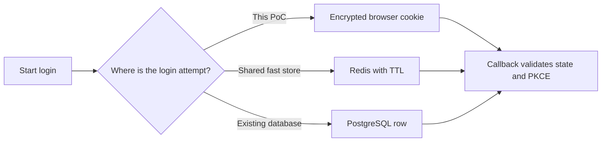
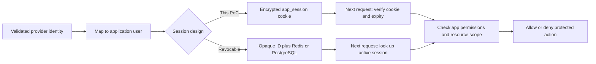
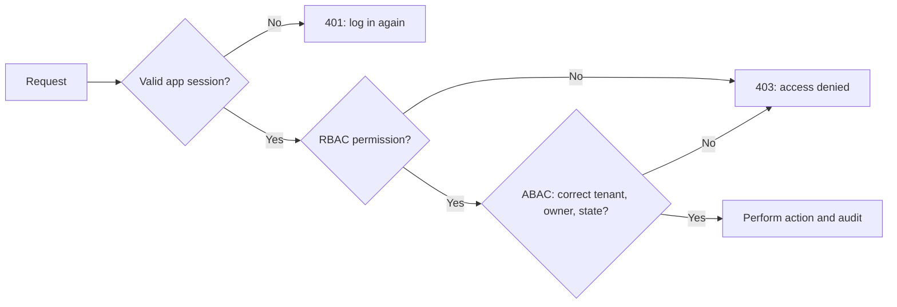

# oauth-oidc-state-pkce-poc

A [knowledge-sharing repository](https://github.com/korawit-cric/oauth-oidc-state-pkce-poc) for understanding how an application can use an external identity provider, then establish and enforce its own browser session. The runnable Next.js demo uses a **local mock provider**, not ThaiD. It does not authenticate a real person or call ThaiD endpoints.

## What this PoC teaches

Authentication with an external provider and authorization inside an application are different responsibilities. The provider establishes an identity; the application validates that result, maps it to an application user, creates a session, and checks access to its own resources. The browser never decides that a callback proves identity on its own.

The flow has two separate credentials: a **temporary login-attempt cookie** used only during the provider redirect, and an **application session cookie** used after login.

```mermaid
sequenceDiagram
    autonumber
    actor Browser
    participant App as Next.js app server
    participant IdP as Local mock provider
    Browser->>App: GET /auth/login
    App->>App: Create state and PKCE verifier
    App-->>Browser: Set encrypted oauth_attempt cookie
    App-->>Browser: Redirect with state and PKCE challenge
    Browser->>IdP: Authorization request
    IdP-->>Browser: Redirect with code and state
    Browser->>App: GET /auth/callback + oauth_attempt cookie
    App->>App: Decrypt cookie; check state and expiry
    App->>IdP: Exchange code with PKCE verifier
    IdP-->>App: Mock identity
    App->>App: Map identity to app user
    App-->>Browser: Clear attempt; set encrypted app_session
    Browser->>App: GET /dashboard + app_session cookie
    App-->>Browser: Validate session; show protected page
```

The mock provider lives in this repository for learning. In a real integration, the provider is a separate service and the backend must validate its OIDC response.

The temporary `oauth_attempt` cookie contains a random `state`, a PKCE verifier, and a five-minute expiry. AES-256-GCM provides both confidentiality and tamper detection. The callback compares state, uses the verifier to exchange the code, and clears the attempt cookie. A separate `app_session` cookie holds the mapped application identity and a one-hour expiry. Both cookies are `HttpOnly` and `SameSite=Lax`; they are `Secure` in production. The dashboard validates the app session on the server. Logging out clears it.

## Architecture choices from the authentication guide

The supplied authentication guide's ThaiD sections (25 and 27) describe several ways to keep OAuth login state and application sessions. They share the same trust boundary: the frontend starts login and follows redirects; the backend creates and validates state, exchanges the provider response, maps the external identity, and creates an application login; the identity provider authenticates the person. Provider endpoints, scopes, claims, and client authentication must come from the actual ThaiD integration contract.

### 1. Where to keep the temporary login attempt

The app must remember the random `state`, PKCE verifier, expiry, and possibly a safe return path while the browser visits the provider. The callback must validate that state before using the authorization code.



All three choices can carry the same logical state. They differ in where it is kept and whether the backend can consume it exactly once.

| Option                         | How it works                                                                                              | Strength                                      | Cost or limitation                                                                                                           |
| ------------------------------ | --------------------------------------------------------------------------------------------------------- | --------------------------------------------- | ---------------------------------------------------------------------------------------------------------------------------- |
| Redis                          | Store an attempt keyed by a state hash with a short TTL; the callback atomically consumes it              | One-time use and sharing across app instances | Requires Redis operations and availability                                                                                   |
| PostgreSQL                     | Store an attempt row with state hash, protected verifier, expiry, and `used_at`; mark it used at callback | Durable and works with an existing database   | Adds reads/writes and cleanup policy                                                                                         |
| Protected cookie (chosen here) | Encrypt and authenticate state, verifier, and expiry in a short-lived browser cookie                      | No login-attempt store; simple to run         | Cannot reliably enforce one-time use across parallel requests without shared state; requires careful key and cookie handling |

The PoC uses AES-256-GCM because the verifier should be hidden as well as protected from modification. A signature alone proves integrity but leaves cookie contents readable. The cookie is `HttpOnly` and `SameSite=Lax`, has a five-minute maximum age, and becomes `Secure` over production HTTPS. The browser returns it to the callback; the server decrypts it, checks expiry and state, uses the verifier, then clears it. A shared store is the better choice when exact single-use consumption or operational control is required.

### 2. Where to keep the application session

After a provider identity is validated, the app maps that provider subject to its own user. The provider credential is not the app's permission model. Future business requests should use an application session and enforce current roles, permissions, and tenant boundaries on the server.



**Remember:** logging in proves who the user is; the permission and resource checks decide what that user can do.

| Option                                           | Browser carries                   | Server does on each request              | Best fit and tradeoff                                                                                |
| ------------------------------------------------ | --------------------------------- | ---------------------------------------- | ---------------------------------------------------------------------------------------------------- |
| Redis session                                    | Opaque random session ID          | Look up session and current user         | Fast shared lookup and immediate revocation, with another service to operate                         |
| PostgreSQL session                               | Opaque random session ID          | Look up non-expired, non-revoked session | Straightforward when PostgreSQL is already present, at database-request cost                         |
| Stateless encrypted/signed session (chosen here) | Protected app identity and expiry | Verify cryptography and expiry           | No central lookup, but copied cookies remain usable until expiry and embedded roles can become stale |

The PoC's `app_session` is an encrypted, authenticated one-hour cookie. Logout removes it from this browser; it does **not** invalidate a copy already stolen. A production system needing immediate logout, cross-device revocation, or fresh permissions should use server-side sessions or add a revocation/version check. A hybrid is also possible: keep the short-lived login attempt in an encrypted cookie, then issue a Redis or PostgreSQL-backed app session.

### 3. Refresh and authorization are separate decisions

This demo has no refresh token. When the hour-long app session expires, the user starts login again. For a longer-lived experience, the guide presents a frontend-triggered refresh call that sends an `HttpOnly` cookie, and a backend-for-frontend design where the server owns the refresh credential. JavaScript-readable refresh tokens increase exposure to injected scripts. A client should retry an expired request at most once after a `401`; a `403` means the known user lacks permission and should not trigger refresh.

For a protected action, the checks are sequential: identify the user, check the broad permission, then check the specific resource and context.



The authorization diagram is a **production design target**, not behavior implemented by this demo dashboard. After login, RBAC can grant broad permissions through roles; ABAC can restrict actions by resource ownership, tenant, store, region, status, or other context. For example, a store manager's role may permit `order.update_status`, while a resource check must still confirm the order belongs to an assigned store. The backend must enforce both checks near the protected operation. Long-lived embedded role claims become stale when privileges change, which favors short lifetimes or a current server-side lookup. Sensitive changes should be audited.

### Why the cookie approach is chosen for this PoC

For **this teaching repository**, the goal is to expose state, PKCE, the callback, and the app-session boundary with as little infrastructure as possible. A protected login-state cookie and a protected app-session cookie make every step runnable in the web app alone. This is the simplest way to study the mechanics, **not a universal best production architecture**. The choice changes when requirements change:

- Need one-time login attempts, immediate revocation, or several app instances: use Redis-backed state and/or sessions.
- Already rely on PostgreSQL and prefer fewer services: store attempts and sessions there.
- Need no attempt store but revocable sessions: use the hybrid cookie-attempt plus server-session design.
- Need provider/API access after login: define a backend-owned token/refresh lifecycle rather than putting high-value provider tokens in browser JavaScript.

Whatever is chosen, `state` binds the callback to the initiating login, PKCE binds code exchange to the verifier, provider validation establishes external identity, and application authorization decides what that identity may do. Each step solves a different problem.

## Run the demo

Requires Node.js 22.12 or newer and npm. The authentication demo runs through `apps/web`; the NestJS API and database directories are present but are not used in this flow.

1. Install dependencies: `npm install`.
2. Generate a secret: `node -e "console.log(require('node:crypto').randomBytes(32).toString('base64url'))"`.
3. Put it in `apps/web/.env.local` as `AUTH_COOKIE_SECRET=<generated value>`.
4. Run `npm run dev --workspace=web`, open <http://localhost:3000>, and click **Start mock ThaiD login**.
5. Inspect the redirects, `oauth_attempt` and `app_session` cookies, `/dashboard`, and logout in browser developer tools.

Keep the secret out of Git. If you use the root `npm run dev` command, place the secret in the root `.env` so the repository's environment-distribution script can share it with the app.

## Code map

- `apps/web/app/auth/login/route.ts`: generate state and PKCE, set the temporary cookie, redirect.
- `apps/web/app/mock-provider/`: local authorization and token endpoints for teaching.
- `apps/web/app/auth/callback/route.ts`: verify the callback, exchange the code, create the app session.
- `apps/web/lib/auth/`: authenticated encryption and flow types.
- `apps/web/app/dashboard/page.tsx`: server-side session check.
- `apps/web/app/auth/logout/route.ts`: clear cookies.
- [`apps/web/AUTH_DEMO.md`](apps/web/AUTH_DEMO.md): detailed flow and production gaps.

## Boundaries and next steps

The mock provider returns a simplified identity response. A real ThaiD adapter needs the registered endpoints, exact redirect URI, required client authentication, and validation of the actual OIDC identity result, including signature, issuer, audience, expiry, nonce where applicable, and claim mapping. Do not treat a callback query parameter or an unverified decoded token as identity.

The current mock code is not one-time. The app session is stateless, so clearing one browser's cookie does not revoke a copied cookie. The PoC also does not implement durable user mapping, RBAC/ABAC, tenant checks, audit logs, rate limits, or a production CSRF strategy for state-changing actions. Those are application responsibilities to add before real use; roles and permissions must be enforced server-side against current data.
